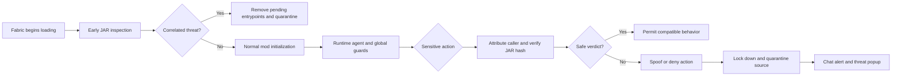

<div align="center">
  

  <h1>AntiRat</h1>

  <p>Layered credential-theft detection and runtime containment for client-side Fabric mods.</p>

  <p>
    <a href="https://github.com/MoleClient/AntiRat/releases/latest"></a>
    <a href="LICENSE"></a>
    
    
  </p>
</div>

> [!IMPORTANT]
> Download AntiRat only from this repository's [Releases page](https://github.com/MoleClient/AntiRat/releases). Select the JAR whose filename exactly matches your Minecraft version.

AntiRat is a client-only Fabric security mod built to detect, interrupt, and contain common Minecraft account stealers and remote-access trojans distributed as mods. It combines pre-initialization scanning with live call-site enforcement, credential-access decisions, exfiltration barriers, evidence-correlated quarantine, and in-game reporting.

Installation is one step: place the correct AntiRat JAR in the profile's `mods` folder. AntiRat does not require Fabric API, a server plugin, a companion application, a whitelist, or custom launcher arguments.

The animated threat-details panel is implemented against each supported Minecraft GUI API rather than replaced by a generic fallback screen. The whole composition scales responsively at automatic and high GUI scales, and its complete 256 x 256 logo is decoded from the JAR and registered directly with Minecraft's texture manager, so the full interface remains visible without Fabric API.

## Download

| Minecraft | Java | Release asset |
| --- | ---: | --- |
| 1.21.1 | 21 | `antirat-1.21.1-2.0.0.jar` |
| 1.21.4 | 21 | `antirat-1.21.4-2.0.0.jar` |
| 1.21.8 | 21 | `antirat-1.21.8-2.0.0.jar` |
| 1.21.11 | 21 | `antirat-1.21.11-2.0.0.jar` |
| 26.1 | 25 | `antirat-26.1-2.0.0.jar` |
| 26.1.2 | 25 | `antirat-26.1.2-2.0.0.jar` |
| 26.2 | 25 | `antirat-26.2-2.0.0.jar` |

Every release JAR declares one exact Minecraft version. Fabric will reject an artifact placed in a neighboring version rather than attempting to load incompatible mixins.

## Protection model



### Pre-initialization scanning

AntiRat runs through Fabric's language-adapter and `preLaunch` phases before ordinary mod initializers. Its bounded scanner examines:

- compiled class constant pools and behavioral scopes;
- configuration and text resources;
- nested archives and concealed class/archive magic;
- native artifacts and suspicious archive structure;
- split constants, high-entropy payloads, and known credential or egress capabilities; and
- bounded decoding layers including Base64, URL-safe Base64, hex, percent escapes, Java escapes, reversal, ROT13/Caesar shifts, short XOR, gzip, and zlib.

Obfuscation, networking, token APIs, nested JARs, native files, or entropy are not individually enough to quarantine a mod. High-confidence containment requires correlated behavior such as a credential source plus an exfiltration capability, multiple independent credential-source categories, or concealed executable code paired with sensitive-file access.

### Session and Authlib barriers

When mod code requests a Minecraft session credential, AntiRat attributes the live call chain to its source JAR, recalculates its SHA-256 identity, and reuses a startup verdict only when the bytes are unchanged. Safe verified callers remain compatible; risky, changed, locked-down, or unattributed callers receive empty spoofed data.

Coverage includes standard session accessors, session IDs, direct field access, reflection, nested reflection, MethodHandles, method references, VarHandles, Unsafe routes, and Authlib join-request credential carriers. Original Minecraft and Microsoft authentication origins are treated separately so AntiRat does not intentionally interfere with normal server authentication.

### File, network, and escape barriers

Runtime enforcement covers common stealer behavior across:

- Minecraft launcher account stores, Discord data, browser profiles, Firefox data, keychains, keyrings, wallets, and process metadata;
- `Files`, streams, channels, providers, file URLs, reflective constructors, MethodHandles, asynchronous channels, and file-backed JDBC URLs;
- Discord, Slack, Telegram, and collector-style webhooks;
- `URL`, `HttpClient`, WebSocket, sockets, datagrams, DNS, socket factories, channels, desktop browsing, and direct Netty destinations;
- child processes, process pipelines, environment harvesting, risky native-library loads, raw Unsafe memory, and runtime class definition; and
- private AntiRat state and instrumentation tampering.

AntiRat does not record credential values, request bodies, file contents, or full process arguments. Reports store sanitized destinations, source identities, hashes, categories, scores, and detection evidence.

### Quarantine behavior

Critical startup detections are moved from `mods` to `.antirat/quarantine/<timestamp>/` before their normal initializer can run. Required dependents are disabled when necessary so the next launch can resolve cleanly.

Runtime detections immediately deny the attributed source's guarded capabilities and move its original JAR in a background containment task. Minecraft is not deliberately restarted in-world because abruptly terminating the client can damage world state. Already-loaded malicious code cannot be safely unloaded from a shared JVM, so it remains locked down until the player exits normally; the next launch omits the quarantined JAR.

## In-game commands

AntiRat consumes its commands locally before they can be sent to a server.

```text
/antirat list
/antirat placeholder
/antirat info <mod-id>
/antirat scan <mod-id>
/antirat quarantine <mod-id>
/antirat unquarantine <mod-id> [confirm]
```

`scan` is read-only. Manual quarantine never restarts Minecraft. Unquarantine verifies the stored hash, refuses to overwrite an active version, and requires `confirm` when restoring a high-confidence detection.

## Verification

Every supported target was compiled, unit-tested, and launched independently through Fabric Loader 0.19.3. An inert adversarial runtime fixture attempted 40 guarded behaviors and then opened the complete animated threat-details panel on each version. A target passed only after a real post-resource-reload frame reached the end of its entrance animation with the bundled logo ready and the evidence section still inside the panel bounds.

| Verification | Result |
| --- | ---: |
| Supported Minecraft versions launched | 7 / 7 |
| Live runtime barrier checks | 280 / 280 |
| Animated popup render checks | 7 / 7 |
| Total live assertions | 287 / 287 |
| Release checksum and metadata audits | 7 / 7 |

The fixture exercises session and Authlib access, credential files, file-copy and file-URL paths, reflection, constructors, scanners, MethodHandles, method references, asynchronous channels, JDBC, processes, pipelines, environment access, native loading, sockets, DNS, dynamic code, Unsafe, tampering, attribution, non-crashing memory containment, and runtime quarantine.

Fixture source: [`src/runtimeFixture/java/dev/runtimefixture/RuntimeAttackFixture.java`](src/runtimeFixture/java/dev/runtimefixture/RuntimeAttackFixture.java)

## Build from source

JDK 21 and JDK 25 are required to reproduce the complete release matrix.

```bash
./scripts/build-all.sh
./scripts/verify-dist.sh
```

The scripts write release JARs and `SHA256SUMS` to the ignored local `dist/` directory.

Build one 1.21.x target with Java 21:

```bash
./gradlew clean test build -Ptarget_mc=1.21.8
```

Build one 26.x target with Java 25:

```bash
./gradlew -p platform/modern clean test build -Ptarget_mc=26.2
```

Run the live fixture for a legacy target:

```bash
./gradlew -Ptarget_mc=1.21.11 prepareRuntimeFixture
./gradlew -Ptarget_mc=1.21.11 -PantiratRuntimeFixture runClient
./gradlew -Ptarget_mc=1.21.11 verifyRuntimeFixtureResult
```

For 26.x, run the equivalent tasks against `platform/modern` with Java 25.

## Repository layout

| Path | Purpose |
| --- | --- |
| [`src/main/java/com/antirat`](src/main/java/com/antirat) | Shared scanner, agent, guards, quarantine, commands, and client logic |
| [`src/compat`](src/compat) | Version-specific Minecraft client and mixin adapters |
| [`src/test`](src/test) | Unit, adversarial-corpus, compatibility, and integration tests |
| [`src/runtimeFixture`](src/runtimeFixture) | Inert live-client attack simulation |
| [`platform/modern`](platform/modern) | Java 25, unobfuscated 26.x Loom build |
| [`scripts/build-all.sh`](scripts/build-all.sh) | Reproducible seven-version build |
| [`scripts/verify-dist.sh`](scripts/verify-dist.sh) | Checksum, metadata, agent, icon, and bytecode audit |

## Configuration overrides

A locally reviewed startup false positive can be allowed by exact SHA-256 in `config/antirat.properties`:

```properties
allow.sha256=0123456789abcdef0123456789abcdef0123456789abcdef0123456789abcdef
```

That does not grant session-token access. A mod that genuinely requires the token needs a separate exact-binary override:

```properties
allow.credentialSha256=0123456789abcdef0123456789abcdef0123456789abcdef0123456789abcdef
```

Treat a credential override as explicit trust in that exact file. Neither override is required for normal use.

## Security boundary

AntiRat materially raises the difficulty of stealing credentials from a Fabric mod, but it is not an operating-system sandbox and does not claim perfect protection. Fabric mods share one JVM, filesystem identity, memory space, and network namespace.

The following remain outside or beyond a client-only mod's strongest guarantees:

- a compromised launcher, Fabric Loader, JVM, or operating system;
- native exploits that escape Java instrumentation;
- code that executes before Fabric can expose AntiRat;
- phishing, password theft, or Microsoft-account compromise outside Minecraft; and
- entirely novel behavior that is indistinguishable from legitimate authentication before a credential is released.

Do not intentionally execute real malware to test AntiRat. Use the included inert fixture. Report suspected vulnerabilities privately according to [`SECURITY.md`](SECURITY.md).

## License

AntiRat is available under the [MIT License](LICENSE).
